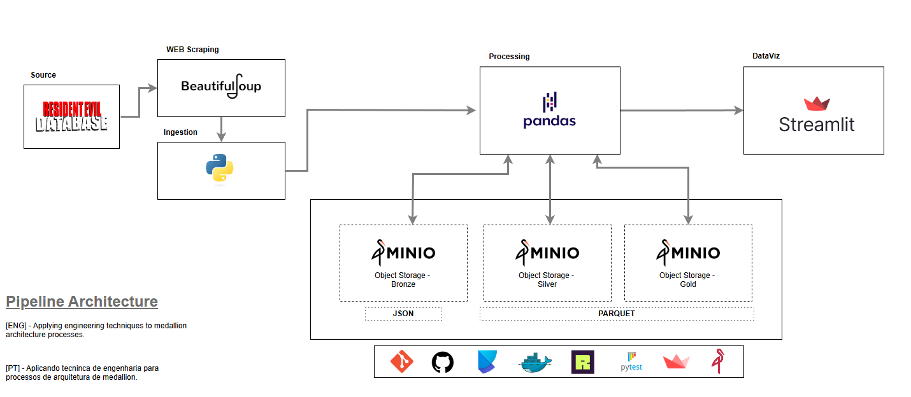
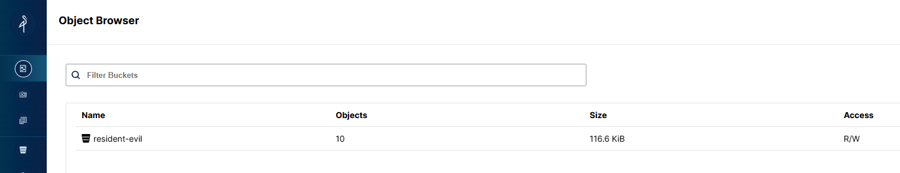
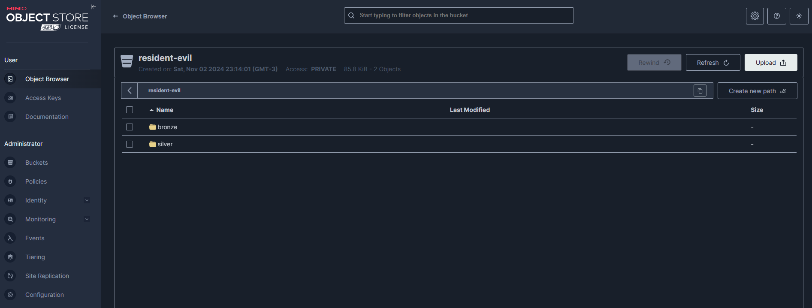
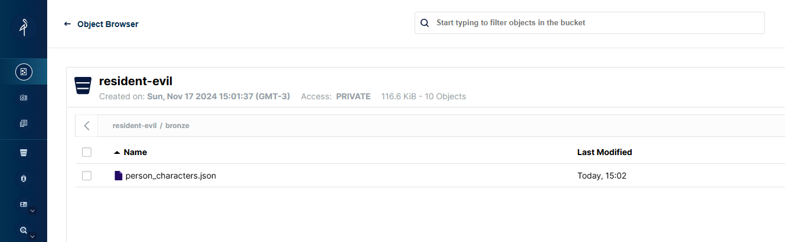
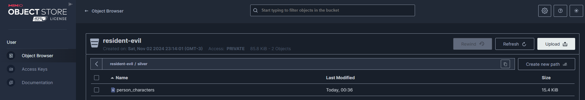
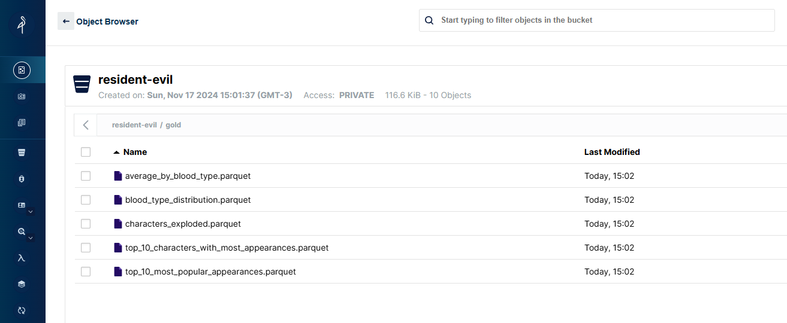

# 🎯 Projeto: Data Resident Evil

## Coleta de Dados e Data Lake com MinIO
Este projeto de arquitetura open source tem como foco a raspagem de dados de personagens do universo ``Resident Evil``, com armazenamento em um ``data lake`` e exibição em um dashboard interativo. A construção visa boas práticas e clareza em todos os aspectos, da arquitetura à escrita do código.

### Objetivos:
* Implementar um data lake seguindo a arquitetura ``medallion``.
* Utilizar ``BeautifulSoup`` para a raspagem dos dados.
* Armazenar os dados na camada Bronze em formato JSON com Python.
* Realizar transformações nas camadas Silver e Gold com ``pandas``.
* Escrever *testes unitários* utilizando ``pytest``.
* Aplicar o ``ruff`` para garantir a *formatação* do código Python.
* Criar um dashboard com ``Streamlit`` para visualização gráfica dos dados da camada Gold.
* Subir todos os serviços via ``Docker``.

A arquitetura proposta é a seguinte:
<table>
    <td>
    </img></td></tr>
</table>

## Estrutura do Projeto
* `.git` - Controle de versão.
* `.pytest` - Configurações para testes unitários.
* `.ruff_cache` - Cache do Ruff para linting.
* `.venv` - Ambiente virtual com dependências do projeto.
* `.gitignore` - Arquivo de exclusões do Git.
* `.python-version` - Versão do python utilizada no projeto.
* `requirements.txt` - Dependências do projeto.
* `pyproject.toml` - Configurações e dependências do projeto com Poetry. 
* `README.md` - Documentação principal do projeto.
* `assets/` - Imagens e arquivos de mídia utilizados na documentação.
* `docs/` - Documentação suplementar.
* `notebook` - Analises pontuais em notebook
* `src/resources/` - Arquivo de conexão com o MinIO e demais funcionalidades de coleta e inserção.
* `src/scrapy/` - Arquivo principal com a respagem de dados do projeto.
* `src/` - Arquivo endereçados como Bronze, Silver e Gold, que é o core do projeto.
* `tests/` - Arquivo que propõe teste unitários em classes e métodos.


## Estrutura de Pastas

```bash
|
|── .gitignore
|── .python-version
|── requirements.txt
|── poetry.lock
|── pyproject.toml
|── README.md
|── src/
|   |── resources/
|   |   |── __init__.py
|   |   └── minio_manager.py
|   |── scrapy/
|   |   |── __init__.py
|   |   |── collect.py
|   |   └── paramns.py
|   |── tools/
|   |   |── transform.py
|   |   └── rules_gold.py
|   |── __init__.py
|   |── bronze.py
|   |── silver.py
|   └── gold.py
|
└── tests/
        |── test_1.py
        └── test_2.py
```

## Setup do Projeto

#### **1. Clone o repositório**
```bash
> git clone https://github.com/imbrunoagc/data-resident-evil.git
> cd data-resident-evil
```

#### **2. Execute o projeto**
```bash
> docker-compose up
``` 

## Setup de execução do projeto em Docker
Como o projeto está construido em serviços docker, o que é preciso para levantar os serviços é `docker-compose up`, agora quando subir e você acessar o caminho http://127.0.0.1:9001/ em seu navegador. verá que vai existir 1 bucket com as seguintes camadas `bronze, silver e gold`.

Agora, faça um ``docker-compose down -v``, para derrubar os serviços e deletar os volumes.

## Métricas e Regras | Gold
# Métricas e Regras

| **Métrica**                     | **Cálculo/Regra**                                                                 | **Gold? (Sim/Não)**                                                                                                        |
|----------------------------------|-----------------------------------------------------------------------------------|---------------------------------------------------------------------------------------------------------------------------|
| **Top Personagens Populares**   | Ordenar por `aparicoes` e selecionar os top N (ex: top 10).                       | **Sim** - Uma visão consolidada e resumida que agrega dados de outras camadas.                                            |
| **Distribuição por Tipo Sanguíneo** | Contar o número de personagens por `tipo_sanguineo`.                                | **Sim** - Agrega dados categóricos que podem ser usados em análises e dashboards.                                         |
| **Média de Altura por Tipo Sanguíneo** | Calcular `mean(altura)` agrupando por `tipo_sanguineo`.                              | **Sim** - Transformação de dados brutos para uma métrica consolidada.                                                    |
| **Média de Peso por Tipo Sanguíneo** | Calcular `mean(peso)` agrupando por `tipo_sanguineo`.                                | **Sim** - Métrica consolidada para análises específicas.                                                                 |
| **Altura x Peso (Scatter)**     | Não há agregação; apenas exibição individual dos dados (gráfico de dispersão).     | **Não** - Dados brutos, melhor na camada **Silver** para análise exploratória.

## Como executar o ruff?

```bash
# Execução para verificar o código
> ruff check .

# Execução para verificar o código e corrigir
> ruff check . --fix
```

## Como executar o pytest?


## Como executar o Streamlit?
```bash
# Para execução local, basta seguir com a instalação do pacote stramlit
> pip install streamlit | poetry add streamlit

# Execução local
> streamlit run app.py
```

# Screenshot

## MiniIO

- 1. Bucket Criado.
<table>
    <td>
    </img></td></tr>
</table>

- 2. Camadas do medallion.
<table>
    <td>
    </img></td></tr>
</table>

- 3. Registros na camada Bronze no formato **JSON**.
<table>
    <td>
    </img></td></tr>
</table>

- 4. Registros na camada Silver no formato **PARQUET**.
<table>
    <td>
    </img></td></tr>
</table>

- 5. Registros na camada Gold agregados/sumarizados no formato **PARQUET**.
<table>
    <td>
    </img></td></tr>
</table>

## Demo App
[](https://data-resident-evil-medallion-to-deploy.streamlit.app/)

## Colab notebook graphics
[](https://github.com/imbrunoagc/data-resident-evil/blob/main_medellion/notebook/visualize_data_gold.ipynb)


## Streamlit
